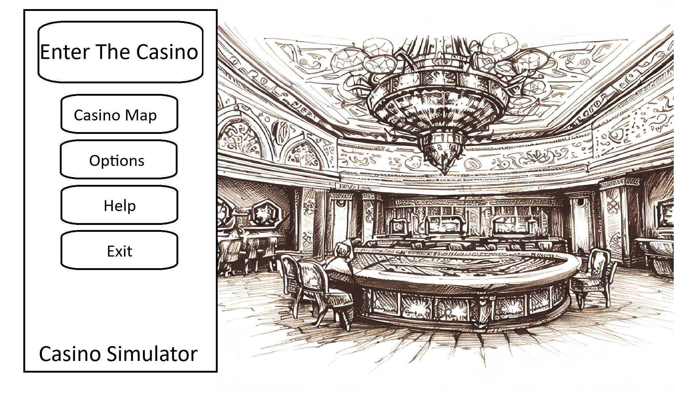
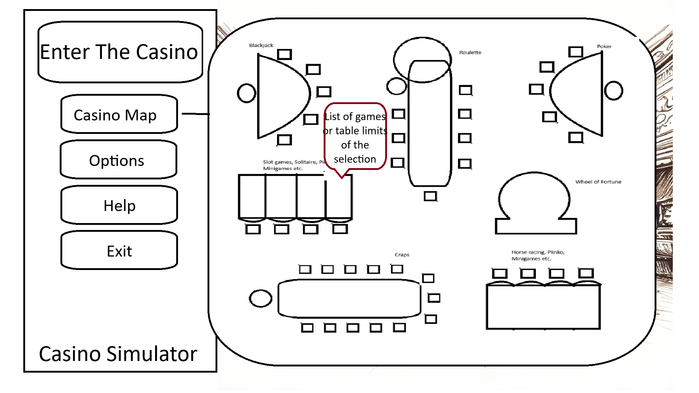
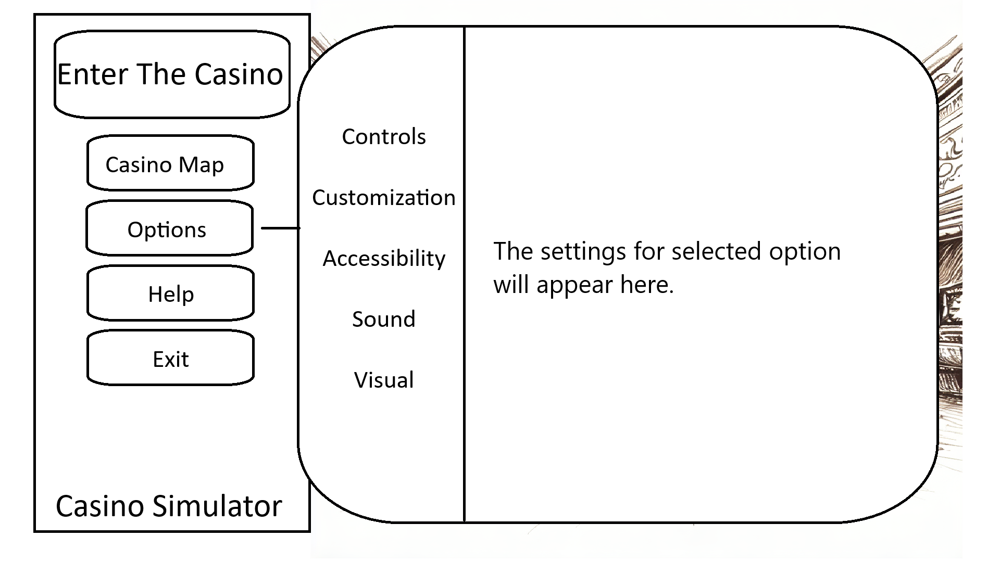
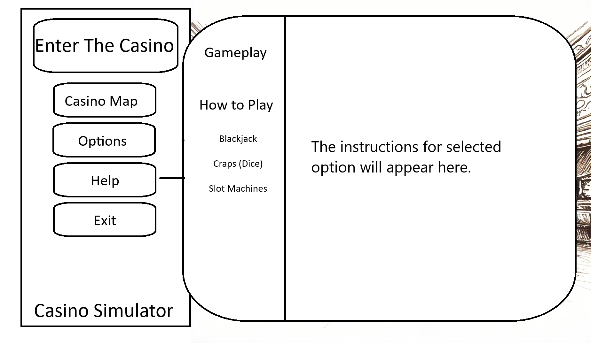
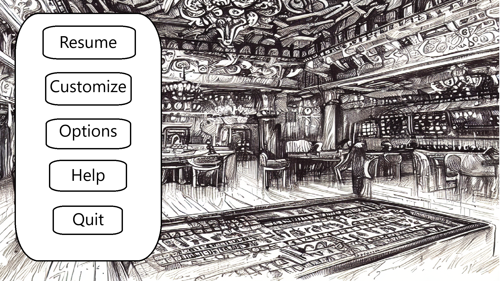
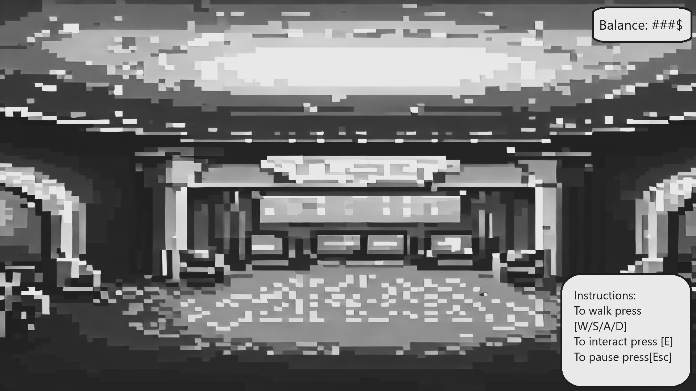
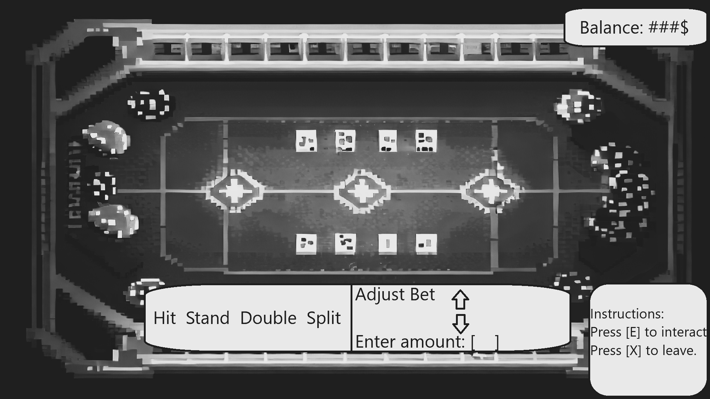
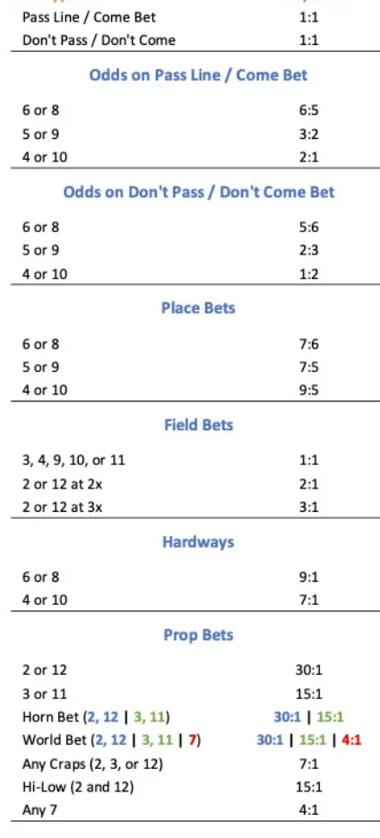

# CSCI 265 Requirements and specifications (Phase 2\)

## Team name: Section 3

## Project/product name: Gambling Simulator

## Contact person and email

 * Josiah Bowden, [josiahbowden4@gmail.com](mailto:josiahbowden4@gmail.com)

## Introduction and overview

Our product will be a gambling simulation with multiple casino games for users to try their luck on. Our purpose for the game is to give people the rush and excitement of gambling without the risk of actually losing money. This can either help people who have a gambling addiction overcome said addiction or help make the new generation of casino goers. Some of its core features will include an open 3D environment to simulate how a real casino feels, with the sounds and bright flashing lights to make it feel like you are really there. As well as a few classic casino games, like slot machines, blackjack and craps. This will be targeted to an audience of people above the legal age to gamble. This will be on a desktop platform with a downloaded application.  The game will not arrive with real money transfers at the start, so you can't make real money from it.   

## User interface and navigation
Here we discuss the general plans for the user interface and how the user will navigate through the different screens/open world.

1. Main Menu  
The screen has a background image of the casino lobby. The Main Menu options are aligned vertically on the left side of the screen for easy navigation.  

	1. Enter the Casino: A large button located at the top of the menu. Selecting this option takes the player directly into the 3D casino environment where they can interact with games and other features.  
	2. Casino Map (optional): This is a drop-down menu, offering a list of available games (like Poker, Blackjack, etc.) with icons for each game. Players can select a game from the list and jump directly to it, bypassing the need to roam the 3D environment.  
	3. Options: Opens a submenu with further customizable settings like Controls, Customization, Sound, Accessibility, and Visuals. Each category has its own settings.  
	4. Help: This option opens a help menu that provides instructions on controls, gameplay mechanics, and rules for each available game.  
	5. Quit: This option allows the player to exit the game and return to the desktop.

2. Casino Map  
A map available in the main menu or within the game itself. The menu contains available casino games such as dice, Blackjack, Slots.   
  
Clicking on a game icon (and then selection from a list for a specific table limit or game) will take the player directly to that game’s area in the casino without needing to explore the entire 3D environment.

3. Options Menu  
When selected, a pop-up box appears. This box is divided into categories that appear as tabs on the left-hand side, with specific settings displayed on the right when each tab is selected.  

	1. Controls/Key Bindings: Allows players to customize the movement controls (e.g., WASD for movement) and interaction keys (like spacebar or enter for actions).Players can configure game-specific controls depending on the games (e.g., card controls for Poker).  
	2. Customization:Adjusts the appearance of various in-game elements, such as the color and design of chips, cards, and tables. Also allows players to set custom win/loss sounds.  
	3. Accessibility: Features settings for subtitles, font sizes, and colorblind-friendly modes to enhance the visual experience for different player needs.  
	4. Sound: Allows players to adjust the volume of background music, sound effects, and possibly the voice-over of the dealer. Players can mute or fine-tune sound levels for a more personalized experience.  
	5. Visuals: Lets the player modify graphical settings, such as screen resolution, texture quality, and display modes (full-screen or windowed).

4. Help Menu  
The Help Menu consists of text-based instructions and simple icons to provide visual aid.  
The menu may include tabs or buttons to access guides for different games (e.g., Blackjack, Craps, Slots).  

	1. Gameplay: General instructions for controlling the player character in the casino (e.g., moving, interacting with objects) and navigating the environment.  
	2. How to Play Each Available Game: Step-by-step instructions for playing the available casino games, including rules and controls for each game.

5. Pause Menu

When the game is paused (e.g., by pressing “Esc”), the Pause Menu appears on the left side of the screen.  

	1. Resume: Allows the player to return to the ongoing game.  
	2. Customize: Provides access to customization options for chips, cards, and table visuals during gameplay.  
	3. Options: Opens the full options menu to allow for changes to controls, sound, and graphics settings mid-game.  
	4. Help: Gives access to a quick reference guide for gameplay controls, rules, and how-to guides for each casino game.  
	5. Quit: Exits the current game and returns the player to the main menu.

#### In-Game Navigation:  
While exploring the casino, players can easily switch between games by simply walking to another table, players can interact and start a new game. Once a game concludes, players can be returned to the main casino view where they can walk around or choose another game. For the quick-play option players can access the casino map by returning to the main menu. 

1.Movement Controls (Exploring the Casino)  
Once the player has entered the casino, the game switches to a 3D environment where the player can move freely to explore the space and interact with different elements like tables, slots, or other minigames.

	1. Default Movement Controls: W, A, S, D or Arrow Keys for movement. The mouse is used to adjust the camera view.  
	2. E (interaction key): Used to interact with objects such as game tables, slots, or other elements in the casino environment.

2. Interaction with Games and Objects  
Interacting with Game Tables: As the player approaches a game table, an interaction prompt will appear, usually indicating the key to press (e.g.,\[E\]) to start playing the game. Once the player interacts, the camera may zoom in on the table, and the game interface will appear such as betting options or card layouts.

3. In-Game HUD (Heads-Up Display)  
Once inside the casino environment or a game, the player will have access to the HUD.   

	1. Basic controls are shown in the bottom right corner such as movement and interaction keys.  
	2. Player’s Current Currency/Balance is displayed on the top right corner, this shows how much in-game money the player has to gamble with.  
 	If the player runs out of currency, the game might offer a chance to "borrow" or restart with a small amount to keep playing.

When engaging in a specific game, the HUD will display relevant information such as the cards in your hand, betting amounts, or options for actions like Hit/Stand in Blackjack.

4. Game-Specific Controls  
When the player enters a game, they are presented with unique controls and options based on the game type. Use Arrow Keys or Mouse to select the desired action.  

	1. Blackjack: buttons appear at the bottom of the screen. Adjust betting amounts with a slider, clicking on available chips (5, 10, 25, etc.) or by entering the amount.  
   		1. Hit: Draw another card.  
   		2. Stand: Stay with current cards.  
   		3. Double Down: Double the bet and receive one more card.  
   		4. Split: If you have two of the same card, split them into two hands.  
	2. Craps: Adjust betting amounts, and place chips on the desired betting area. Simply press the interaction key (or spacebar ) to roll the dice.  
	3. Slots: Simply press the interaction key (or spacebar ) to spin the reels. Players can adjust their bet size with buttons on the screen.

## Product features and behavior

### Casino Hub World
In this section, we discuss the needs for the open world casino that the player will be walking around in. It will be go over the layout, the physics and collision logic, and rough ideas on how it will be implemented. 
1. Overview
For the casino hub, we need it to be a 3d world that the player can move around in to get to the tables to play the games. We need to ensure that the visuals are clear, the layout makes sense and that there are no invisible walls the player can run into.

2. Collision Logic
While the player is walking around, we want to make sure they can’t walk through tables or walls. We need to be able to track the players movements to ensure a smooth gameplay experience, and we also need to make sure that when the player is near a table of game that the option to play the game pops up for them. 
3. Implementation
For implementing this while nothing is set in stone we plan to us unity to code our game. We will make a walkable 3d world in unity and have the ability to enter into the other games from this open world. 
4. Performance
We plan to have this be a pc game so we want to optimize it for windows machines
5. Testing
Our team member Hugh is in charge of testing during production.

### Blackjack
In this section we discuss the plans we have for the blackjack game, and some basic plans for the implementation of it.
1. Game Overview  
    BlackJack is a classic card game where the objective is to get a higher value from your cards added together then the dealer while not going over 21

2. UI Design  
   1. The layout will be a 2d blackjack table  
   2. There will be chips at the bottom with different values for people to bet  
   3. On the table there will be different place outlined for cards to go  
   4. There will be a button on the table for the player to start the game  
   5. When the cards are dealt buttons labeling options for the player will appear for them to choose what they would like to do next  
        
3.  Gameplay   
   1. Since blackjack is player vs dealer, the only bot will be the dealer the player plays against    
   2. Gameplay will involve three phases  
   3. The first phase will be the initial betting and deal  
      1. Players will choose an initial betting amount  
      2. Players will be dealt two cards from a standard 52 card deck  
      3. The dealer is dealt two cards, one face up and shown to the players and the other face down  
   4. The second phase will be the “Play”  
      1. Players can now choose to do one of a few options  
         1. Stand: Players can choose to stay with their current cards, and wait for the “Dealers Play”  
         2. Hit: Players can ask for another card to try and get closer to 21  
         3. Split: If the player has two of the same card(Ie two jacks or 2 sixes) they can split, splitting the pair, a bet equal to the initial bet goes into both cards, and another card get dealt to each card making the player play with two hand  
         4. Double: If the players initial cards add up to 9, 10, or 11, they can double, double their initial bet, and another card is played face down in front of them, and turned at the end of the play.  
         5. Insurance: If the dealer's face up card is an ace the players can make a side bet up to half the original bet, and if the face down card is value of ten, dealer blackjack, the players get a payout of 2-1 for their side bet  
      2. Once everyone has chosen to stand it moves onto the dealers play  
   5. Dealers Play  
      1. On the dealers play they reveal their facedown card  
         1. If the value if 17 or higher, the stand and compare their hands to the rest of the players, players that have higher value win their bet, players that are lower lose, and in ties players get their bet back  
         2. If the value is 16 or lower, the dealer hits until they reach 17, if they bust everyone who stood wins, while those who busted still lose. If the dealer doesn’t bust refer to previous point  
4. Rules  
   1. The deck of cards is the standard 52 deck  
   2. Face cards, (King, Queen, Jack) have a value of 10  
   3. Aces either have a value of 1 or 11  
   4. If a player goes over 21, they bust and lose their bet  
5. Card randomization  
   1. This game will use a standard 52 card deck, we want to make sure it is randomized and only gives on of each card(ie doesn’t give out 2 six of hearts)  
   2. We plan to have it shuffle after each game to make it that people can’t card count  
6. Performance 

   	This game will be on PC so we plan to have it optimized and running well on windows machines

7. Testing

   	Our team Member hugh will be testing during production, giving feedback  and recommendations

   

### Slots
In this section we go over how we plan to implement the slot machines into our casino. We will discuss the main gameplay and some initial plans on how to implement it. 
1. Game Overview  
   1. We will have two main types of slots for the player to interact with  
      1. Classic (3 reel slots)  
      2. Modern (5 reel slots)  
   2. We will have up to eight lines for the 3 reel slots to bid on and varying bidding amounts   
   3. For the 5 reel slots there will be up to 25 lines to bet on based on lateral symmetry within the slot reels  
2. UI Design  
   1. For ui design one of the most common slot machines is based off of 7s so we will likely be able to find assets for both the machines using those and other classic slot icons.  
   2. There will be a variety of special effects that are associated with winning and there will be an animation for when you spin the slots  
3. Gameplay  
   1. Betting is the same for both the 3 and 5 reel slots just with different line amounts  
      1. The player will decide on how many lines they would like to bet on and how much money to bet on each line  
      2. The players will then press spin and be able to decide when to stop the slots or they could also decide to just let the computer spin it for a random amount of time  
4. Winning  
   1. The winning is based on sequences on the betted upon lines and vary depending on the length of sequence and the symbols within the sequence  
      1. For 3 reel slots there will be different fruit, bells, crowns, bars, diamonds,  and 7’s each will give progressively more but be more rare in response.  
         1. Cherries 2 in a row \- 1:5  
         2. Cherries full line \- 1:10  
         3. Oranges full line \- 1:15  
         4. Blueberries full line 1:20  
         5. Bells full line 1:40  
         6. Watermelon full line 1:60  
         7. Bar full line 1:100  
         8. Crowns full line 1:200  
         9. Diamonds full line 1:500  
         10. All fruit 1:2  
         11. 2 7’s 1:10  
         12. 3 7’s 1:30  
         13. 4 7’s 1:100  
         14. 5 7’s 1:500  
         15. 6 7’s 1:1,000  
         16. 7 7:s 1:10,000  
         17. 8 7’s 1:100,000  
         18. 9 7’s 1:1,000,000  
         19. 7’s full line 1:10,000  
      2. For 5 reel there will be fruit, bells, bars, crowns, wild, scatter, and 7’s for regular symbols the winning starts at 3 on any line that has been bet on  
         1. Wild \- takes on properties of both the one to left and right of symbol  
         2. Scatter is based on symbols on board not on a betted line  
            1. 3 symbols \- 5 free spins  
            2. 4 symbols \- 15 free spins  
            3. 5 symbols \- 60 free spins  
         3. Cherries   
            1. 3 \- 1:5  
            2. 4 \- 1:15  
            3. 5 \- 1:60  
         4. Oranges  
            1. 3 \- 1:5  
            2. 4 \- 1:20  
            3. 5 \- 1:100  
         5. Blueberries  
            1. 3 \- 1:5  
            2. 4 \- 1:25  
            3. 5 \- 1:150  
         6. Watermelons  
            1. 3 \- 1:10  
            2. 4 \- 1:60  
            3. 5 \- 1:450  
         7. Bells  
            1. 3 \- 1:10  
            2. 4 \- 1:70  
            3. 5 \- 1:600  
         8. Bars  
            1. 3 \- 1:25  
            2. 4 \- 1:200  
            3. 5 \- 1:1500  
         9. Crowns start at 2 symbols in a line  
            1. 2 \- 1:10  
            2. 3 \- 1:50  
            3. 4 \- 1:400  
            4. 5 \- 1:3500  
         10. 7’s start at 2 symbols in a line  
             1. 2 \- 1:10  
             2. 3 \- 1:60  
             3. 4 \- 1:500  
             4. 5 \- 1:5000  
5. Random Number Generator
To represent the different reels in the game, we are going to make a random number generator to simulate it. We are going to assign different symbols to different numbers. This allows us to simulate a slot machine reel.

### Dice
For this section we discuss how we plan to implement our dice game. We go over the style of craps we have chosen, its basic rules and odds, and some initial implementation ideas. 
1. Game Overview   
   1. The dice game we have chosen is casino/bank Craps.  
   2. The game will follow traditional rules

   

2. UI Design  
   1. The layout will be a standard craps table, there will also be dice and a variety of chips that the user can customize.   
   2. There will be a menu that allows the user to select their bets, as well as roll the dice

3. Gameplay Cycle  
   1. The user will be able to bet on dice using any “money” they currently possess. After the game is selected from the main world, an interface will appear and introduce the player to the game. The player will go through the steps of betting, then rolling the dice. The player will start by making a pass or don’t pass bet, and any other wagers before rolling or “shooting” the dice. When bets are selected, the odds will be shown to the player, and there will be an interface for selecting the amount to bet. The player may quit after a round, but not during. Since Casino Craps can be played solo, we will not be implementing any AI/multiplayer for this game.  
4. Winning Conditions   
   1. While there is not really a “winning condition” for the game overall,(other than leaving with more money than you started with), each round does have a win condition. The round will be won if the criteria to win whatever bets have been placed has been met. See the following sections of the types of bets that can be made.  
5. Compliance with Standardized Rules (same rules as any casino)   
   1. Since the style of game we will be implementing is Casino/Bank Craps, we will follow all existing rulesets and odds for wagers.  
   2. Wagers:   
      Here is a list of the planned wagers and their payouts:  
      1. Pass line bet: This is one of two possible bets required to shoot. In this wager, the player wins if the come out roll is a 7 or 11, and they lose if they roll a 2,3 or 12\. If anything else is rolled, a point will be set at that number and the player must roll the point again before they roll a 7 to win. Additional bets may be placed in between rolls.  
      2. Don’t pass bet: This is the other of two possible wagers required to start to start the round. This bet wins on 2 or 3 on the come out roll, loses on 7 or 11, and ties on 12\. If any other number is rolled, a point is established at that number and this bet will win if a 7 is rolled before the point number is rolled again. In other words, it is the opposite of a pass bet.  
      3. Come bet: This bet may only be placed after a point has been set. This bet wins if the next roll is a 7 or eleven and loses on 2,3 or 12, just like a pass bet. Also like a pass bet, if any other number is rolled, this becomes your “come point” and must be rolled again before a 7 is rolled in order to win.  
      4. Don’t come bet: The don’t come bet is like an opposite come bet, and similar to a don’t pass bet. After a point is established, you win if the next roll is 2 or 3, tie on 12, and lose on 7 or 11\. If another number is rolled, this becomes your “come point” and if repeated, you lose, and you win on a 7 roll.  
      5. Field Bet: This bet only lasts a single roll, and may be placed at any time. The bet wins if the next roll is a 3,4,9,10 or 11, with a double payout on 2, and a triple payout on 12\. The bet loses on a 5,6,7 or 8\.   
      6. Free Odds: These bets are placed after a pass or come bet.  A player bets on a 7 to be rolled before a number of their choice of any of 4,5,6,8,9 or 10\.   
      7. Place bets: These bets can be made at any time. A player chooses a number from 4,5,6,8,9 or 10 and wagers that it will be rolled before a 7 is rolled. There are different payouts for each choice of number.  
      8. Buy bets: These bets can be made at any time, and are very similar to place bets. A player chooses a number from 4,5,6,8,9 or 10 and bets that it will be set as a point number before a 7 is rolled. There are different payouts for each choice of number.  
      9. Big six and big eight: This is the same as a free odds bet but only with a choice of 6 or 8, and with worse odds. This may be cut from our version, as is the case with many casinos.  
      10. Hardways bets: These are bets on the specific numbers 4,6,8, or 10\. The player wagers that their number will be rolled the ‘hard way’ before the ‘easy way’ or a 7\. The “hard way” to roll a number is when both the dice have the same value, adding to the chosen number (ie 4+4=8). Thus, The “easy way” is if the values of the dice are uneven (ie 3+5=8).   
      11. 2 or 12 Bets: The player chooses either 2 or 12, and wins if the next roll is the number of their choice. They lose on any other number.  
      12. 3 or 11 bets: Same as 2 or 12 bets, but with 3 or 11 for slightly better odds.  
      13. Any 7 bet: If the next roll is a 7, the player wins, and loses on any other roll.  
      14. Any Craps Bets: In craps the numbers 2,3,12 are known as “craps numbers”. In this wager, the player bets the next roll will be one of these numbers.  
          
  
          Payout odds for all bets.

6. Random Number Generation   
   The RNG will be based on two six-sided dice. We will use existing functions to simulate dice rolling where each die will land on a side, 1-6. The program will adhere to industry standards to ensure that each roll is unpredictable and fair because each dice roll must represent authentic dice rolls just as if the player picked up a pair of dice and rolled themselves.   
     
7. Performance/Optimization  
   The game will primarily be played as a desktop application so we will ensure that it runs smoothly on that platform. Having an optimized and efficient game is important for the user's experience.   
     
	1. We will ensure that the game has minimal load times by optimizing asset sizes such as images, audio and animation. 

   

	2. Only loading high resolution animations when they are needed, such as the rolling of dice, or winning and losing animations. 

   

	3. Managing memory efficiently by clearing assets when leaving the game and preventing memory leaks that can degrade performance. 

   

	4. Even though the game is primarily going to be played on pc, it will be optimized to fit a variety of screen sizes, like by scaling the UI and assets to accommodate different screen sizes. 

   

	5. Using loading indicators (progress bar) to let the user know that the game hasn’t frozen.   
     
8. Testing/QA   
   Our team member Hugh, will be testing the game throughout development giving us feedback, recommendations and finding any bugs or glitches in our game. Also making sure that we give the user an enjoyable experience as well as performance testing.    
   
### What happens if they run out of Money?
If the player runs out of Money, a game over screen pops up. It will then give the player a chance to restart as if they were loaded in for the first time or the option to quit the game. The next time the player plays, there will be an indicator on the players profile that shows they went bankrupt the last time they played. This will be a running counter that counts how many times the player goes bankrupt. Some stretch goals of ours include a cosmetics shop, and if the player goes bankrupt their will be the option to sell their cosmetics to not go bankrupt.  

## Feature prioritization
Here we discuss the features and how we plan to prioritize them. We split this up into two sections for our features, the core feature and the secondary features.
 
Core Features:

* We want to have a walkable 3d casino  
* A playable blackjack game  
* A playable slot machine  
* A playable craps game

Secondary Features:

* Buyable cosmetics with the in game money  
* A battle pass with different cosmetics  
* More games, such as  
  * Poker  
  * Wheel of Fortune  
  * Roulette  
  * Alternative slots games  
  * Horse racing  
  * Solitaire  
  * Pinball  
  * Baquerat  
  * Basset  
  * Plinko

