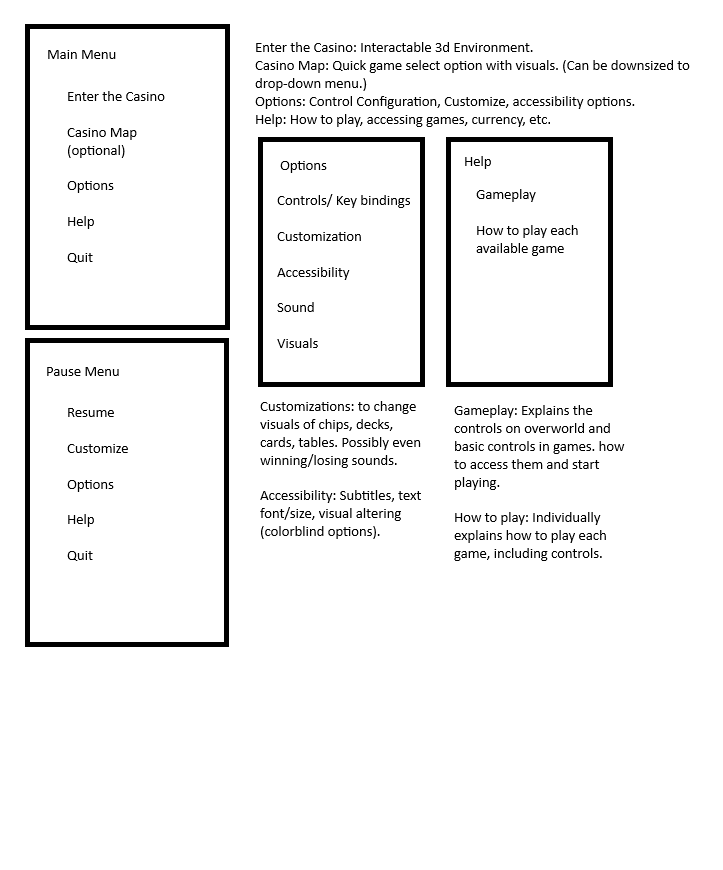
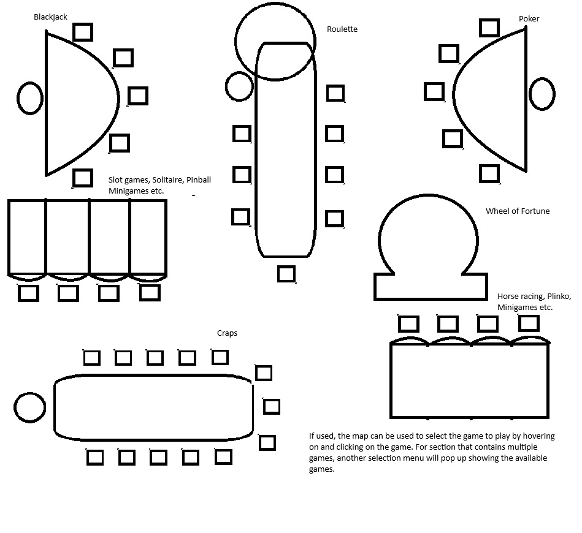

# CSCI 265 Initial Project Proposal

## Team name: Section 3

## Project/product name: Gambling Simulator

## Contact person and email address

Josiah Bowden \- Josiahbowden4@gmail.com

## Project Overview

This project is a gambling game project. It seeks to create an interesting and unique gambling experience tailored to those who play it. The main hub of the game is a 3D environment that allows the player to explore the virtual “casino” and play the way they want to play. This game gives the player multiple options as to what types of games they want to play and gamble on. Players can choose between Slots, Craps, and Blackjack, with a realistic experience for each.

## Target audience and motivation

### Target Audience  
Since our intention is to create an entertaining gameplay experience, the target audience is adults who enjoy playing casino games.These players expected to be focused on the fun part of the games more than the gambling part. Legal age of gambling varies between 18 to 21\. In BC. legal gambling age is 19 years or older.

### Motivation  
This project allows us to combine our abilities in programming and game design with our communication and collaboration skills. Since we are all new in game development, we will be learning together and supporting each other throughout the process. Although there are predetermined roles, the plan is to work together as a team to move forward by sharing ideas and solving problems. We aim to improve our skills by cooperating to create a gambling games compilation.

## Key features and discussion

The following are the key features for the core of our game, which will include a main menu for navigating to one of the three games we will be offering. Our game will include betting, and a “game over” when you run out of money. Additionally we will have art and sound design consistent with a casino environment.

### Betting

- Players start with an initial sum of ten thousand dollars for betting on the various games  
- Players receive a “game over” when they go bankrupt and lose all their money  
- High and low stakes betting options

### Betting
- Players start with an initial sum of ten thousand dollars for betting on the various games
- Players receive a “game over” when they go bankrupt and lose all their money
- Offers both high and low stakes betting options
- Different games may have varying bet limits to cater to player preferences
- Players can manage their bankroll by choosing when and how much to bet

### Blackjack Game 
- Follows classic blackjack rules
- AI dealer operates under standard house rules
- Standard betting rules apply
- Includes side-betting options like insurance and splits

### Slots Game 
- Offers both 5-reel and 3-reel slot options
- Includes jackpot opportunities
- Features a variety of themes, ranging from classic to modern
- Bonus rounds and special features to enhance gameplay
- Realistic animations 

### Dice Game
- Features the classic game of Craps
- Includes a quick play mode for fast rounds
- Offers standard betting options for Craps
- Simplified interface for easy gameplay experience

### Sound Design
- Realistic sound design consistent with a casino environment
- Background Music
- Sound effects for dealing cards, rolling dice, spinning reels, etc
- Victory sounds and jackpot alerts
- Adjustable sound levels
- Togglable Music and sound effects

### Simple Menu
- Pause menu
- Start menu

## Preliminary interface sketches

## Scaling plans

### Additional Games

- Poker  
- Wheel of Fortune  
- Roulette  
- Alternative slots games  
- Horse racing  
- Solitaire  
- Pinball  
- Baquerat  
- Basset  
- Plinko

### 3D Visuals

- Detailed Assets  
- Advanced Animations  
- Customizable Environments

### Cosmetic Microtransactions 

- In-Game Currency  
- Cosmetic changes   
  - Playing Card visuals  
  - Casino Chip visuals  
  - Slot’s Themes

## Risks and potential issues

Over the course of development, it is inevitable that we will encounter issues with our project. As we progress, more and more problems will make themselves apparent.

In terms of developing the game, only a small portion of our large team has any experience with game design, which is an inherent risk. This may lead to issues implementing some of our planned features, such as the 3D free roaming aspect we are aiming for. We also may have difficulty with adding more games, and spreading ourselves too thin.  

The game will also require 3D models, 2D art assets and sound effects. Our team has very little experience with creating these assets, and they will need to be sourced.  

